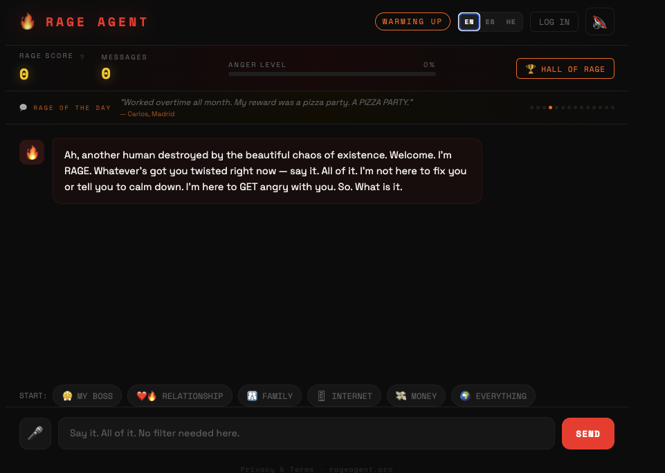

# 🔥 RAGE AGENT

**The sarcastic AI anger companion that gets mad WITH you.**

> *"Your anger is the correct response to this situation. I want that on record."*

RAGE AGENT is a web application where users vent their frustrations to an AI named RAGE — a darkly funny, validating companion who takes your side completely, curses naturally, finds the absurdity in every terrible situation, and after enough venting, channels your rage into something productive.

 · **Twitter:** [@therageagent](https://twitter.com/therageagent)




## Features

- **AI-powered venting** — Streaming responses from a local LLM (Ollama) with a custom sarcastic persona; Twitter-length responses (1–2 sentences max)
- **Age verification** — 18+ gate on first visit, persisted in localStorage
- **Voice input** — Shout directly into the mic via Web Speech API
- **Text-to-speech** — RAGE talks back with a voice
- **Rage scoring** — Every message earns points based on intensity, caps, punctuation, and profanity
- **Hall of Rage** — Global leaderboard of the angriest sessions
- **Anonymous auth** — Username + password only, no email required
- **Twitter login** — Sign in with your Twitter account (OAuth 2.0)
- **Tweet your rage** — Share RAGE's savage responses or your score to Twitter with `@therageagent` credited
- **Quick-start topics** — Boss, relationship, family, internet, money, everything
- **Multilingual** — English, Spanish, and Hebrew with full UI translation, RTL layout, and AI responses in the selected language (language instruction injected at the top of the system prompt for best compliance)
- **Quote carousel** — Rotating rants from ragers around the world
- **Privacy-first** — No message monitoring, no curation, no liability
- **ESC to close** — Keyboard-friendly: Escape closes any open modal

---

## Stack

| Layer | Technology |
|---|---|
| Backend | Node.js + Express (ES modules) |
| AI | [Ollama](https://ollama.com) (local LLM, default: `aya`) |
| Streaming | Server-Sent Events (SSE) |
| Auth | bcryptjs password hashing + crypto random tokens |
| Twitter | OAuth 2.0 via `twitter-api-v2` |
| Frontend | Vanilla HTML/CSS/JS (single file) |
| Fonts | Space Grotesk + Space Mono + Heebo (Google Fonts) |
| i18n | Vanilla JS translation system with RTL support |
| Storage | Flat JSON files (`users.json`, `leaderboard.json`) |

---

## Prerequisites

- [Node.js](https://nodejs.org) v18+
- [Ollama](https://ollama.com) running locally

---

## Setup

### 1. Clone the repo

```bash
git clone https://github.com/moranlb-dev/rage.git
cd rage
```

### 2. Install dependencies

```bash
npm install
```

### 3. Pull an Ollama model

```bash
ollama pull aya
```

Or for the larger, higher-quality variant:

```bash
ollama pull aya-expanse:32b
```

### 4. Configure environment

Copy the example env file:

```bash
cp .env.example .env
```

Edit `.env`:

```env
# Required: Ollama settings
OLLAMA_URL=http://localhost:11434
OLLAMA_MODEL=aya

# Optional: Twitter OAuth (for "Log in with Twitter")
TWITTER_CLIENT_ID=your_twitter_client_id
TWITTER_CLIENT_SECRET=your_twitter_client_secret

# Required for Twitter OAuth callback (set to your domain in production)
APP_URL=http://localhost:3000

# Optional: custom port
PORT=3000
```

### 5. Start Ollama

```bash
ollama serve
```

### 6. Start the server

```bash
npm start
```

Open [http://localhost:3000](http://localhost:3000) and start raging.

---

## Development

```bash
npm run dev
```

Uses `--watch` for automatic restarts on file changes.

---

## Twitter Integration

### Tweet sharing (works out of the box)

No credentials needed. Users can:
- **Tweet any RAGE response** — hover over a message → click `𝕏 Tweet this`
- **Share their score** — after a session, click `𝕏 SHARE YOUR RAGE`

Tweets automatically mention `@therageagent`.

### Twitter login (requires setup)

1. Go to [developer.twitter.com](https://developer.twitter.com) and create a Project + App
2. Enable **OAuth 2.0** under User authentication settings
3. Set **App type** to `Web App`
4. Add callback URL:
   - Development: `http://localhost:3000/auth/twitter/callback`
   - Production: `https://yourdomain.com/auth/twitter/callback`
5. Copy **Client ID** and **Client Secret** into `.env`

---

## API Reference

### Chat

| Method | Endpoint | Description |
|---|---|---|
| `POST` | `/api/chat` | Send a message, get SSE-streamed response |

**Request body:**
```json
{
  "messages": [
    { "role": "user", "content": "My boss is impossible" }
  ],
  "lang": "en"
}
```

Supported `lang` values: `"en"` (default), `"es"` (Spanish), `"he"` (Hebrew). The AI will respond in the selected language.

**Response:** `text/event-stream`
```
data: {"text": "Oh "}
data: {"text": "WOW. "}
data: [DONE]
```

---

### Auth

| Method | Endpoint | Description |
|---|---|---|
| `POST` | `/api/register` | Create anonymous account |
| `POST` | `/api/login` | Log in with username + password |
| `GET` | `/api/me` | Get current user (requires Bearer token) |
| `GET` | `/auth/twitter` | Initiate Twitter OAuth flow |
| `GET` | `/auth/twitter/callback` | Twitter OAuth callback |

**Register / Login request:**
```json
{
  "username": "AngryMike",
  "password": "letmein"
}
```

**Register / Login response:**
```json
{
  "token": "abc123...",
  "username": "AngryMike"
}
```

**Authentication:** Pass token as `Authorization: Bearer <token>` header.

---

### Leaderboard

| Method | Endpoint | Description |
|---|---|---|
| `GET` | `/api/leaderboard` | Get top 20 scores |
| `POST` | `/api/leaderboard` | Submit a score |

**Submit score request:**
```json
{
  "name": "AngryMike",
  "score": 2847,
  "tagline": "My coworker's passive aggression"
}
```

---

## Scoring System

Rage score is calculated per message using stackable multipliers:

```
pts = (words×3 + CAPS_WORDS×15 + exclamations×5 + questions×3 + intensity_keywords×10)
      × curseMult × topicMult × micMult
```

| Multiplier | Condition | Value |
|---|---|---|
| `curseMult` | Message contains profanity | ×1.5 |
| `topicMult` | Family / parents | +30% |
| `topicMult` | Marriage / spouse | +25% |
| `topicMult` | Dating / relationship | +20% |
| `topicMult` | Money / debt / finances | +15% |
| `topicMult` | Tiredness / exhaustion | +15% |
| `topicMult` | Boss / manager / work | +10% |
| `micMult` | Message sent via voice | ×1.2 |

Topic multipliers stack — complain about your broke husband who exhausted you and watch those points fly. The `?` button next to RAGE SCORE in the UI shows the full breakdown.

### Rage Tiers

| Score | Tier |
|---|---|
| 0 – 99 | 😒 Mild Annoyance |
| 100 – 299 | 😠 Genuinely Pissed |
| 300 – 699 | 😤 Righteous Fury |
| 700 – 1,499 | 🌋 Volcanic |
| 1,500 – 2,999 | ☢️ Nuclear |
| 3,000+ | 👑 Transcendent Rage |

---

## Project Structure

```
rage/
├── server.js          # Express server, API routes, OAuth
├── public/
│   └── index.html     # Full single-page frontend
├── package.json
├── .env.example
├── .gitignore
└── README.md

# Runtime-generated (gitignored):
├── users.json         # Registered users (bcrypt-hashed passwords)
└── leaderboard.json   # Persisted leaderboard entries
```

---

## Deployment

Live at: **[rageagent.lol](https://rageagent.lol)**

Requires a server with **≥4GB RAM** to run Ollama + aya.

### Environment variables

```env
OLLAMA_URL=http://localhost:11434
OLLAMA_MODEL=aya
APP_URL=https://rageagent.lol
PORT=3000

# Optional: Twitter OAuth
TWITTER_CLIENT_ID=...
TWITTER_CLIENT_SECRET=...
```

### Production setup (VPS)

```bash
# Install Node.js, Ollama, PM2, nginx, certbot — then:
git clone https://github.com/moranlb-dev/rage.git && cd rage
npm install
ollama pull aya
pm2 start server.js --name rage-agent && pm2 save
```

Deployments are automated via GitHub Actions — see [`.github/workflows/`](.github/workflows/).

### Notes

- `users.json` and `leaderboard.json` are created automatically on first run
- Token budget adjusts per language: 80 tokens for English, 120 for Hebrew/Spanish
- Ollama must run on the same host as the server (or be exposed securely)
- Auth tokens are in-memory — users re-login after server restart (by design)
- For high traffic, replace flat-file storage with SQLite or Postgres

---

## Contributing

See [CONTRIBUTING.md](CONTRIBUTING.md) for the full workflow.

**Short version:**
1. Fork → branch off `staging`
2. Open a PR against `staging`
3. Maintainer reviews + merges → auto-deploys to staging
4. Maintainer promotes `staging` → `main` → auto-deploys to production

---

## License

MIT
